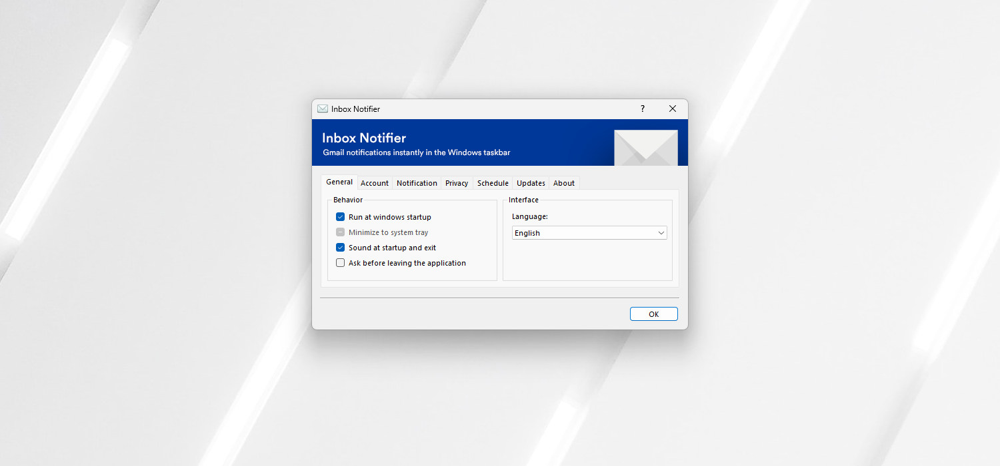

# Inbox Notifier –     
Gmail notifications instantly in the Windows taskbar.

## Features
Inbox Notifier is provided with **a bunch of useful features that bring your inbox always up to date** and keep you focus on your work:

* Synchronization - *automatic sync that keep you up to date every time*
* Email notifications - *display concise notifications when needed*
* SPAM checking - *enforce user to clean SPAMs regularly*
* Do not disturb mode - *keep focus at work*
* Privacy setting - *choose the privacy level for notifications*
* Credential managment - *login and logout with ease*
* Multilingual support - *french/english/german*
* Inbox statistics preview - *display drafts/labels/unreads/totals messages from the inbox*
* Attachment information - *notice when a message have one or more attachments*
* Network reconnection - *try to reconnect to the network when the internet connection is lost*
* Scheduled synchronization - *disable the synchronization to have a peaceful weekend*
* Update service - *keep the application up to date*

Discover application interface and features through **some Youtube videos**:
* [Authentication process and interface](https://www.youtube.com/watch?v=AHrpkeZk56c) - *1:52*
* [Mark as read feature](https://www.youtube.com/watch?v=JQet8zBollQ) - *0:30*

## Compatibility
Inbox Notifier is fully tested on **Windows 7** desktop *(SP1)* and on a **Windows 10** laptop.

Many other Windows operating systems may work, like Windows 8/8.1/Server, but are not extensively tested for the moment. Regarding the .NET Framework version, some operating systems like Windows Vista/XP are no longer supported.

## Dependencies
To ensure a stable running of Inbox Notifier, you need to have **some requirements** setted on your machine.

1. Microsoft `.NET Framework 4.8` minimum required

Note that this version of the .NET Framework **evolve in time**: the application cares about **system security** and having one of the latest .NET version is very important for the final user. By default, if you don't have the required version installed, the application will display a message and propose to download the specified version on the **Microsoft official site**.

## Download
#### Setup installer
The setup installer contains both `32 bits (x86)` and `64 bits (x64)` versions: this is the better way to install Windows application and allow you to **cleanly install/uninstall** the application with ease.

* :package: [Inbox Notifier 3.0.1](https://github.com/xavierfoucrier/inbox-notifier/releases/download/v3.0.0/Inbox.Notifier.3.0.1.exe)

> Note that you will need **administrator rights** to properly complete the installation.

#### History versions
You can grab an old version of the application in the [Github version history](https://github.com/xavierfoucrier/inbox-notifier/tags): keep in mind that the alpha/beta versions are just "pre-releases" and **are not** "production environment" ready. Portable versions are **no longer available since official 1.0 release**. Some installers may **no longer working** due to the OAuth client secret key revocation.

## Privacy policy

Inbox Notifier respect user privacy.

You can **read the [privacy notice](PRIVACY.md)** to see how the application clearly expose the manner in which it accesses, uses, stores, or shares user data.

## Softpedia award
This product was last tested in the **Softpedia Labs** on **February 5th, 2020** by *Tudor Sprinceana*.

Softpedia guarantees that Inbox Notifier is **100% Free**, which means it does not contain any form of malware, including but not limited to: spyware, viruses, trojans and backdoors. This software product was tested thoroughly and was found **absolutely clean**; therefore, it can be installed with no concern by any computer user. However, it should be noted that this product will be retested periodically and the award may be withdrawn, so you should check back occasionally and pay attention to the date of testing shown above.

Read the [Softpedia Labs review](https://www.softpedia.com/get/Internet/E-mail/Mail-Utilities/xavierfoucrier-Inbox-Notifier.shtml) for more informations.

## Contribute
If you want to report a bug or if you just want to request for a new feature/improvement, please **read the project [contributors guidelines](CONTRIBUTING.md) before**. Thanks for taking time to contribute to Inbox Notifier.

## Sponsor
Become a Patron and support this project!  
https://www.patreon.com/inboxnotifier

## License
The project is developed under the **MIT** license:

- **Permissions**: This software and derivatives may be used for commercial purposes, you may distribute this software, this software may be modified and you may use and modify the software without distributing it.
- **Conditions**: Include a copy of the license and copyright notice with the code.
- **Limitations**: Software is provided without warranty and the software author/license owner cannot be held liable for damages.

Read the [full license](LICENSE.md) for more information about your rights.

## Questions?
If you have any questions, please **feel free to contact me!**  
[xavier.foucrier [at] gmail.com](mailto:xavier.foucrier@gmail.com)
